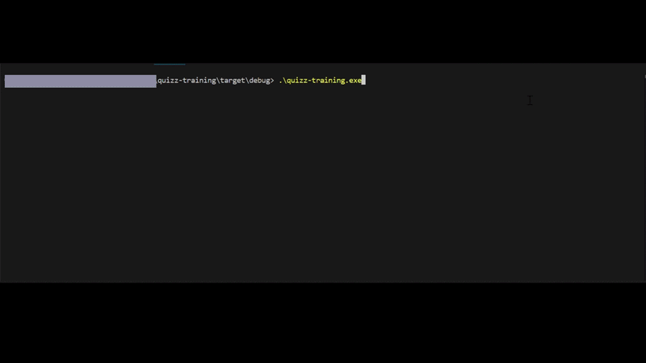

# Quiz Training



A command-line quiz training application, developed in Rust with an interactive terminal interface.

## Description

Quiz Training is a CLI tool that allows you to practice with custom quizzes. The application offers a modern user interface in the terminal thanks to [Ratatui](https://ratatui.rs/) and [Crossterm](https://github.com/crossterm-rs/crossterm).

## Features

- 📚 **Multi-quiz support**: Load multiple quiz files and choose which one you want to practice
- 🎯 **Flexible training modes**:
  - All questions: answer all questions in the quiz
  - Limited number: choose the number of questions you want to be tested on
- 🔀 **Random questions**: Questions are presented in a random order each session
- ✅ **Multiple answer support**: Some questions can have multiple correct answers
- 📊 **Score tracking**: View your results at the end of each session (number of errors, number of questions answered)
- ⌨️ **Intuitive navigation**: Use arrow keys, numbers, or Enter to navigate and select your answers

## Installation / Download

The executable is available on GitHub in the **Releases** section.

### Download

1. Go to the Releases page.
2. Download the latest version for your operating system
3. Extract the archive if necessary
4. Place the executable in the folder of your choice

### Prerequisites

- Windows, macOS, or Linux
- A compatible terminal (cmd, PowerShell, Terminal, iTerm2, etc.)

## How to Use

### Launching the Application

1. Open a terminal
2. Navigate to the folder containing the executable
3. Launch the application:
   ```bash
   ./quizz-training
   ```
   Or on Windows:
   ```cmd
   quizz-training.exe
   ```

### Session Workflow

#### 1. Quiz Selection
If multiple quiz files are available in the `quizz/` folder, the application will ask you to choose which one you want to practice.

- Use the **↑** and **↓** arrows to navigate
- Press **Enter** to confirm your choice

#### 2. Training Mode Selection
Two modes are available:

- **All questions**: The application will take you through all questions in the quiz
- **Limited number of questions**: You can specify the number of questions you want

#### 3. Answering Questions
For each question:

- Navigate through options with the **↑** and **↓** arrows
- Select an option with **Enter** or the numeric keys **1-9**
- For multiple answer questions, select all correct answers
- Navigate to the **Confirm** button and press **Enter** to validate

If your answer is **correct**, you automatically move to the next question.

If your answer is **incorrect**, an error message is displayed and you can try again. For multiple answer questions, a hint will indicate that there are several correct answers.

#### 4. Results
At the end of the session, your score is displayed:
- Total number of questions answered
- Number of errors made

Press **Enter** to start a new session.

### Keyboard Shortcuts

| Key | Action |
|-----|--------|
| ↑ / ↓ | Navigate through options |
| 1-9 | Select an option by its number |
| Enter | Confirm selection |
| Ctrl + X | Exit the application |

## Quiz Format

Quizzes are stored in YAML format in the `quizz/` folder. Here is an example structure:

```yaml
metadata:
  name: "Quiz name"

questions:
  - title: "What is the capital of France?"
    options:
      - Strasbourg
      - Metz
      - Paris*    # The asterisk indicates the correct answer
      - Marseille

  - title: "What to do in case of extreme heat?"
    options:
      - Exercise at noon
      - Drink regularly*     # Multiple answer questions
      - Eat enough*
      - Close all windows*
```

**Important points:**
- Each question must have at least one correct answer marked with `*`
- A question can have multiple correct answers
- The application automatically validates the format at startup

## Documentation

For more technical details, see:
- [`docs/architecture.md`](docs/architecture.md) - Application architecture
- [`docs/specifications.md`](docs/specifications.md) - Functional specifications

## License

This project is licensed under the MIT License. See the [`LICENSE`](LICENSE) file for more details.

---
