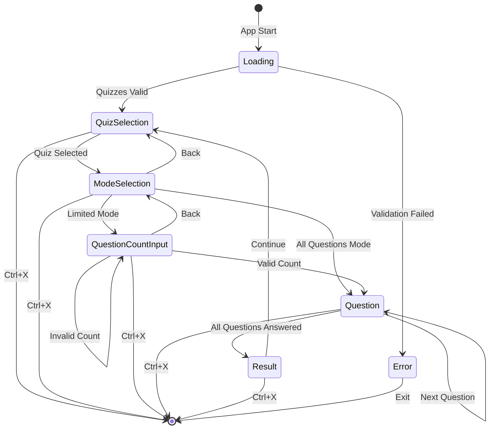
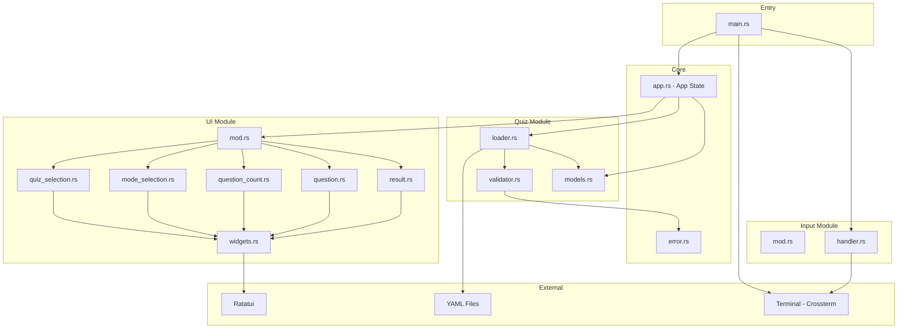
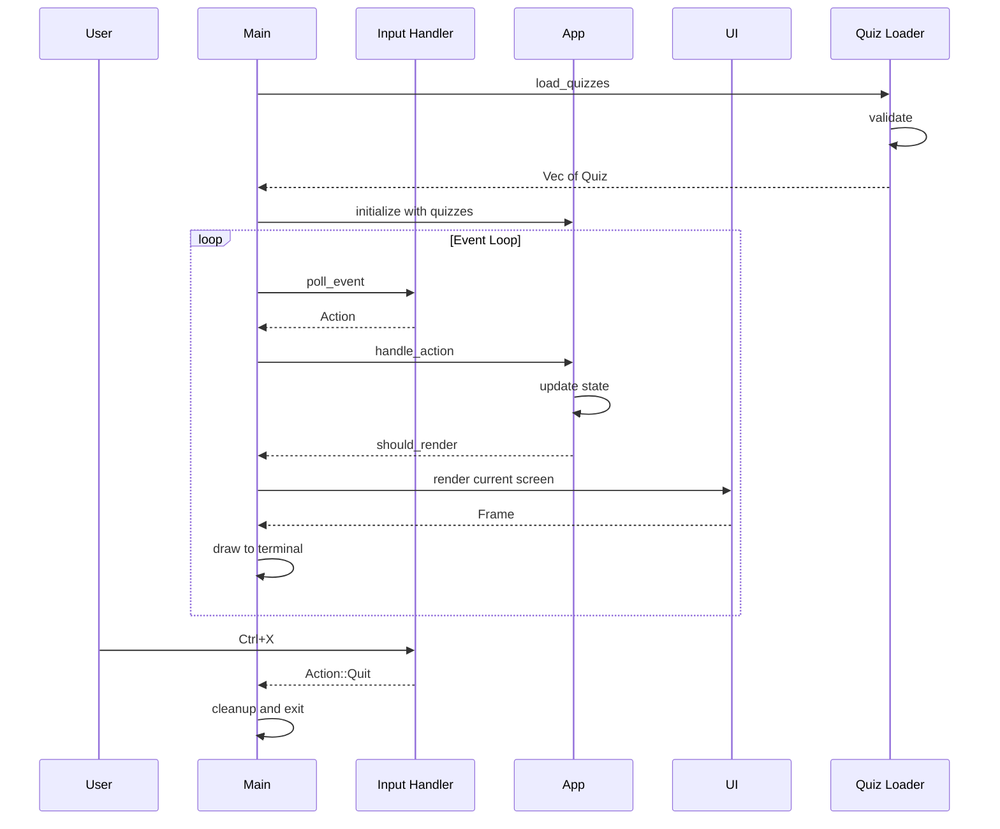

# Quiz Training Application - Architecture Document

## Overview

This document describes the architecture for a Rust-based CLI quiz training application using Ratatui for the terminal UI and Crossterm as the backend.

## Technology Stack

| Component | Technology | Purpose |
|-----------|------------|---------|
| Language | Rust | Core application |
| TUI Framework | Ratatui | Terminal user interface |
| Terminal Backend | Crossterm | Cross-platform terminal handling |
| Serialization | Serde + serde_yaml | YAML quiz file parsing |
| Randomization | rand | Question shuffling |

---

## 1. Module Structure and File Organization

```
quizz-training/
├── Cargo.toml
├── Cargo.lock
├── quizz/                      # Quiz YAML files directory
│   ├── geography.yaml
│   ├── programming.yaml
│   └── ...
├── docs/
│   └── architecture.md
└── src/
    ├── main.rs                 # Entry point, event loop setup
    ├── app.rs                  # Application state and logic
    ├── ui/
    │   ├── mod.rs              # UI module exports
    │   ├── quiz_selection.rs   # Quiz selection screen
    │   ├── mode_selection.rs   # Training mode selection screen
    │   ├── question_count.rs   # Question count input screen
    │   ├── question.rs         # Question display and interaction
    │   ├── result.rs           # Final score display
    │   └── widgets.rs          # Reusable UI widgets
    ├── quiz/
    │   ├── mod.rs              # Quiz module exports
    │   ├── loader.rs           # YAML file loading
    │   ├── validator.rs        # Quiz format validation
    │   └── models.rs           # Quiz data structures
    ├── input/
    │   ├── mod.rs              # Input module exports
    │   └── handler.rs          # Keyboard input handling
    └── error.rs                # Custom error types
```

### Module Responsibilities

| Module | Responsibility |
|--------|----------------|
| `main.rs` | Application bootstrap, terminal setup/cleanup, main event loop |
| `app.rs` | Central application state, screen transitions, game logic |
| `ui/*` | Screen rendering using Ratatui widgets |
| `quiz/*` | Quiz data loading, validation, and models |
| `input/*` | Keyboard event processing and action mapping |
| `error.rs` | Custom error types for quiz validation and loading |

---

## 2. Data Structures

### Quiz Data Models

```rust
/// Represents a loaded quiz file
pub struct Quiz {
    pub metadata: QuizMetadata,
    pub questions: Vec<Question>,
    pub file_path: PathBuf,
}

/// Quiz metadata from YAML
pub struct QuizMetadata {
    pub name: String,
}

/// A single question with its options
pub struct Question {
    pub title: String,
    pub options: Vec<QuizOption>,
}

/// A selectable option for a question
pub struct QuizOption {
    pub text: String,
    pub is_correct: bool,
}

/// Deserialization structures for YAML parsing
#[derive(Deserialize)]
pub struct QuizYaml {
    pub metadata: QuizMetadataYaml,
    pub questions: Vec<QuestionYaml>,
}

#[derive(Deserialize)]
pub struct QuizMetadataYaml {
    pub name: String,
}

#[derive(Deserialize)]
pub struct QuestionYaml {
    pub title: String,
    pub options: Vec<String>,  // Raw strings with * markers
}
```

### Application State

```rust
/// Main application state container
pub struct App {
    pub state: AppScreen,
    pub quizzes: Vec<Quiz>,
    pub selected_quiz_index: usize,
    pub training_session: Option<TrainingSession>,
    pub should_quit: bool,
}

/// Current screen/state of the application
pub enum AppScreen {
    QuizSelection {
        selected_index: usize,
    },
    ModeSelection {
        selected_mode: TrainingMode,
    },
    QuestionCountInput {
        input: String,
        error_message: Option<String>,
    },
    Question {
        feedback: Option<AnswerFeedback>,
    },
    Result,
}

/// Training mode selection
pub enum TrainingMode {
    AllQuestions,
    LimitedQuestions,
}

/// Feedback after answer submission
pub enum AnswerFeedback {
    Correct,
    Incorrect { is_multiple_answer: bool },
}
```

### Training Session State

```rust
/// Active training session data
pub struct TrainingSession {
    pub quiz_name: String,
    pub questions: Vec<Question>,          // Shuffled question list
    pub current_question_index: usize,
    pub selected_options: Vec<bool>,       // Current question selections
    pub selected_ui_index: usize,          // UI cursor position
    pub error_count: usize,
    pub total_questions: usize,
}
```

### Input Actions

```rust
/// All possible user actions
pub enum Action {
    Quit,                    // Ctrl+X
    NavigateUp,              // Arrow Up
    NavigateDown,            // Arrow Down
    Select,                  // Enter
    ToggleOption(usize),     // Number keys 1-9
    Confirm,                 // Enter on Confirm button
    InputChar(char),         // For question count input
    Backspace,               // For question count input
}
```

---

## 3. Application State Machine

The application follows a finite state machine pattern with well-defined transitions between screens.

### State Diagram



### Screen Descriptions

| Screen | Purpose | Available Actions |
|--------|---------|-------------------|
| **Loading** | Initial state, load and validate quizzes | N/A - Automatic |
| **QuizSelection** | Display list of available quizzes | Up/Down, Enter, Ctrl+X |
| **ModeSelection** | Choose training mode | Up/Down, Enter, Ctrl+X |
| **QuestionCountInput** | Enter number of questions | Number keys, Backspace, Enter, Ctrl+X |
| **Question** | Display question and options | Up/Down, Number keys, Enter, Ctrl+X |
| **Result** | Show final score | Enter, Ctrl+X |

### Transition Logic

```
Loading:
  → QuizSelection: when all quizzes loaded and validated successfully
  → Exit with error: when validation fails

QuizSelection:
  → ModeSelection: when Enter pressed on a quiz
  → Exit: when Ctrl+X pressed

ModeSelection:
  → Question: when All Questions selected
  → QuestionCountInput: when Limited Questions selected
  → QuizSelection: when Back/Escape pressed

QuestionCountInput:
  → Question: when valid number entered and confirmed
  → Stay: when invalid input, show error
  → ModeSelection: when Back/Escape pressed

Question:
  → Stay with feedback: when wrong answer submitted
  → Next Question: when correct answer submitted
  → Result: when last question answered correctly

Result:
  → QuizSelection: when Enter pressed
```

---

## 4. Component Diagram

### Module Interactions



### Data Flow



---

## 5. Key Algorithms

### 5.1 Quiz Validation Algorithm

```
FUNCTION validate_quiz(quiz_yaml: QuizYaml) -> Result<Quiz, ValidationError>:
    
    # Check metadata
    IF quiz_yaml.metadata.name is empty THEN
        RETURN Error: Empty quiz name
    
    # Check questions exist
    IF quiz_yaml.questions is empty THEN
        RETURN Error: No questions found
    
    questions = []
    
    FOR EACH question_yaml IN quiz_yaml.questions DO
        
        # Check question title
        IF question_yaml.title is empty THEN
            RETURN Error: Empty question title
        
        # Check options exist
        IF question_yaml.options is empty THEN
            RETURN Error: No options for question
        
        options = []
        has_correct_answer = FALSE
        
        FOR EACH option_text IN question_yaml.options DO
            # Parse option - check for * marker
            IF option_text ends with '*' THEN
                text = option_text.trim_end('*').trim()
                is_correct = TRUE
                has_correct_answer = TRUE
            ELSE
                text = option_text.trim()
                is_correct = FALSE
            
            IF text is empty THEN
                RETURN Error: Empty option text
            
            options.push(QuizOption { text, is_correct })
        
        # Validate at least one correct answer
        IF NOT has_correct_answer THEN
            RETURN Error: No correct answer marked for question
        
        questions.push(Question { title, options })
    
    RETURN Ok(Quiz { metadata, questions })
```

### 5.2 Question Shuffling Algorithm

```
FUNCTION create_training_session(quiz: Quiz, count: Option<usize>) -> TrainingSession:
    
    # Determine question count
    total = count.unwrap_or(quiz.questions.len())
    total = min(total, quiz.questions.len())
    
    # Clone and shuffle questions using Fisher-Yates
    shuffled = quiz.questions.clone()
    
    FOR i FROM shuffled.len() - 1 DOWN TO 1 DO
        j = random_range(0, i + 1)
        swap(shuffled[i], shuffled[j])
    
    # Take only required number of questions
    questions = shuffled.take(total)
    
    RETURN TrainingSession {
        quiz_name: quiz.metadata.name,
        questions: questions,
        current_question_index: 0,
        selected_options: vec![false; questions[0].options.len()],
        selected_ui_index: 0,
        error_count: 0,
        total_questions: total,
    }
```

### 5.3 Answer Validation Algorithm

```
FUNCTION validate_answer(session: TrainingSession) -> AnswerFeedback:
    
    current = session.questions[session.current_question_index]
    
    # Check if selected options match correct options exactly
    FOR i IN 0..current.options.len() DO
        expected = current.options[i].is_correct
        actual = session.selected_options[i]
        
        IF expected != actual THEN
            # Count correct answers to determine if multiple-answer
            correct_count = current.options.filter(|o| o.is_correct).count()
            
            RETURN AnswerFeedback::Incorrect {
                is_multiple_answer: correct_count > 1
            }
    
    RETURN AnswerFeedback::Correct
```

### 5.4 Navigation Algorithm

```
FUNCTION handle_navigation(action: Action, session: &mut TrainingSession):
    
    current_question = session.questions[session.current_question_index]
    option_count = current_question.options.len()
    
    # Total selectable items = options + confirm button
    total_items = option_count + 1
    confirm_index = option_count
    
    MATCH action:
        NavigateUp =>
            IF session.selected_ui_index > 0 THEN
                session.selected_ui_index -= 1
            ELSE
                session.selected_ui_index = total_items - 1  # Wrap to bottom
        
        NavigateDown =>
            IF session.selected_ui_index < total_items - 1 THEN
                session.selected_ui_index += 1
            ELSE
                session.selected_ui_index = 0  # Wrap to top
        
        Select =>
            IF session.selected_ui_index < option_count THEN
                # Toggle option selection
                index = session.selected_ui_index
                session.selected_options[index] = !session.selected_options[index]
            ELSE
                # Confirm button - validate answer
                CALL validate_and_proceed()
        
        ToggleOption(n) =>
            IF n > 0 AND n <= option_count THEN
                index = n - 1
                session.selected_options[index] = !session.selected_options[index]
```

### 5.5 Score Calculation Algorithm

```
FUNCTION calculate_score(session: TrainingSession) -> Score:
    
    RETURN Score {
        total_questions: session.total_questions,
        error_count: session.error_count,
        success_rate: (session.total_questions - session.error_count) 
                      / session.total_questions * 100
    }
```

---

## 6. UI Layout Specifications

### Common Layout Structure

```
┌─────────────────────────────────────────────────────────────┐
│  Quiz Training                                              │  <- Header
├─────────────────────────────────────────────────────────────┤
│                                                             │
│                      [Main Content]                         │  <- Content Area
│                                                             │
├─────────────────────────────────────────────────────────────┤
│  [Available Actions]                        Ctrl+X to quit  │  <- Footer
└─────────────────────────────────────────────────────────────┘
```

### Question Screen Layout

```
┌─────────────────────────────────────────────────────────────┐
│  Quiz: Geography Quiz                    Question 3/10      │
├─────────────────────────────────────────────────────────────┤
│                                                             │
│  What is the capital of France?                             │
│                                                             │
│    [ ] 1. Strasbourg                                        │
│    [ ] 2. Metz                                              │
│    [x] 3. Paris                           <- Selected       │
│    [ ] 4. Marseille                                         │
│                                                             │
│    [  Confirm  ]                          <- Confirm button │
│                                                             │
│  ⚠ Wrong answer! This question has multiple answers.        │
│                                                             │
├─────────────────────────────────────────────────────────────┤
│  ↑↓ Navigate  1-4 Toggle  Enter Select         Ctrl+X Quit  │
└─────────────────────────────────────────────────────────────┘
```

### Result Screen Layout

```
┌─────────────────────────────────────────────────────────────┐
│  Quiz Training - Results                                    │
├─────────────────────────────────────────────────────────────┤
│                                                             │
│                    🎉 Training Complete!                    │
│                                                             │
│                    Quiz: Geography Quiz                     │
│                                                             │
│              ┌─────────────────────────────┐                │
│              │   Questions: 10            │                │
│              │   Errors: 2                │                │
│              │   Success Rate: 80%        │                │
│              └─────────────────────────────┘                │
│                                                             │
│                    [ Continue ]                             │
│                                                             │
├─────────────────────────────────────────────────────────────┤
│  Enter Continue                                 Ctrl+X Quit │
└─────────────────────────────────────────────────────────────┘
```

---

## 7. Error Handling Strategy

### Error Types

```rust
pub enum QuizError {
    // File system errors
    IoError(std::io::Error),
    DirectoryNotFound(PathBuf),
    NoQuizzesFound,
    
    // Parsing errors
    YamlParseError { file: PathBuf, error: serde_yaml::Error },
    
    // Validation errors
    EmptyQuizName { file: PathBuf },
    NoQuestions { file: PathBuf },
    EmptyQuestionTitle { file: PathBuf, question_index: usize },
    NoOptions { file: PathBuf, question_index: usize },
    NoCorrectAnswer { file: PathBuf, question_index: usize },
    EmptyOptionText { file: PathBuf, question_index: usize, option_index: usize },
}
```

### Error Display

All validation errors should be displayed clearly at startup with:
- File name where the error occurred
- Specific issue description
- Question/option index if applicable

---

## 8. Dependencies

```toml
[dependencies]
ratatui = "0.28"
crossterm = "0.28"
serde = { version = "1.0", features = ["derive"] }
serde_yaml = "0.9"
rand = "0.8"
```

---

## 9. Future Considerations

- **Persistence**: Save user progress and statistics
- **Themes**: Customizable color schemes
- **Quiz Editor**: In-app quiz creation and editing
- **Categories**: Group quizzes by topic
- **Difficulty Levels**: Support for question difficulty ratings
- **Time Tracking**: Track time per question and total session time
